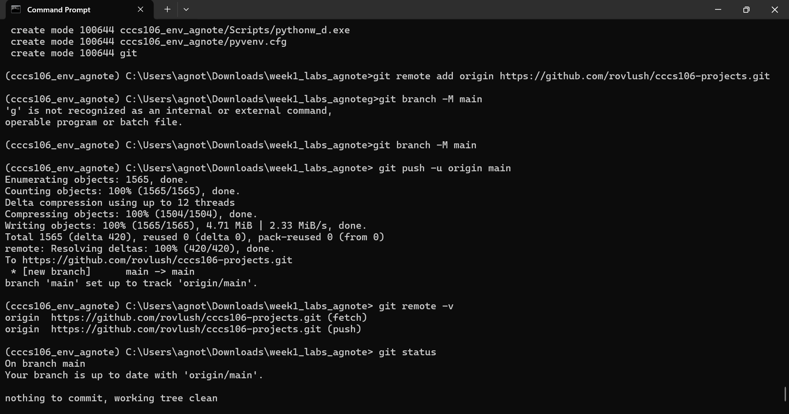
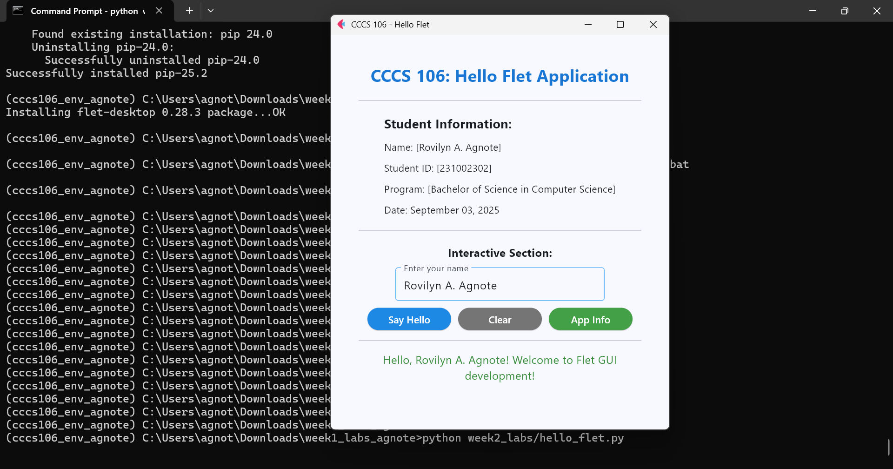
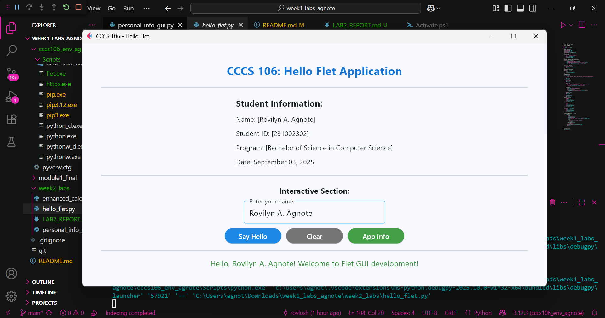

# CCCS 106 Projects
Application Development and Emerging Technologies  
Academic Year 2025-2026

## Student Information
- **Name:** [Rovilyn A. Agnote]
- **Student ID:** [231002302]
- **Program:** [Bachelor of Science in Computer Science]
- **Section:** [A]

## Git Configuration

### Repository Setup
- **Git Repository:** https://github.com/rovlush/cccs106-projects
- **Local Repository:** Initialized and connected
- **Commit History:** [Number] commits with descriptive messages

### Git Skills Demonstrated
- Making, creating, and pushing changes.
- Remote repository control.
- Setting up and preparation of the repositories.

## Flet GUI Application

### 1. hello_flet.py
- **Status:** Completed
- **Features:** Displaying information to students, interactive greeting, dialog box.
- **UI Components:** Text, Buttons, Dialog, Textfield, Containers
- **Notes:** Learned on how to create interactive GUIs using the simple elements of Flet.

### 2. personal_info_gui.py
- **Status:** Completed
- **Features:** Form inputs, dropdowns, radio buttons, profile generation  
- **UI Components:** TextField, Dropdown, RadioGroup, Containers, Scrolling 
- **Error Handling:** Input validation and user feedback
- **Notes:** The greatest problem was input validation, and the introduction of checks resolved the problem. 

## Technical Skills Developed

### Git Version Control
- Acquired the confidence in the development and administration of repositories.  
- Went through the Git process (add -> commit -> push).  
- Knows how to branch out to new features.  
- Trained branch amalgamation and clearing.  

### Flet GUI Development
- Knowledge of the simple layout of a Flet application.  
- Layed out using Containers and Columns.  
- Realized event-based user interaction.  
- Knowledge of modern UI/UX design.    

--- 

## Challenges and Solutions
- **Challenge 1**
    - VS code terminal was not opened in the right virtual environment.
- **Solution**  
    - Chose the right interpreter (cccs106_env) and turned it on then proceeded to execute Flet apps.  

- **Challenge 2**
    - Error when running files from the wrong directory.   
- **Solution**  
    - Used cd week2_labs before executing python hello_flet.py. 

- **Challenge 3**
    - The first push to GitHub did not work since there was no remote branch.   
- **Solution**  
    - Used git branch -M main and git push -u origin main to link properly.   

---

## Learning Outcomes

- Knowledge of the role of Git in the administration of project versions and collaboration.  
- Know how to use *GitHub as a remote backup and collaboration tool.  
- Acquired practical knowledge in the development of Python GUI (Flet).  
- Better care in creating an environment and correcting mistakes.  
- Understood the value of clarifications and documentation in commit messages.  

---

### Git Repository
- [x] GitHub repository with commit history  
  

- [x] Local git log showing commits  
  

### GUI Applications
- [x] hello_flet.py running with all features  
  

- [x] personal_info_gui.py with filled form and generated profile  
  

---

## Future Enhancements
- In week2_labs/enhanced_calculator.py add a complete working version of a *Enhanced Calculator GUI.  
- Enhance the UX and make it more stylish and aligned.  
- Increase the usability with error messages and tooltips.  
- Consider adding a database (SQLite) to store personal data into the GUI application.
 


### Week 1 Labs - Environment Setup and Python Basics
- `week1_labs/hello_world.py` - Basic Python introduction
- `week1_labs/basic_calculator.py` - Simple console calculator

### Week 2 Labs - Git and Flet GUI Development
- `week2_labs/hello_flet.py` - First Flet GUI application
- `week2_labs/personal_info_gui.py` - Enhanced personal information manager
- `week2_labs/enhanced_calculator.py` - GUI calculator (coming soon)

### Module 1 Final Project
- `module1_final/` - Final integrated project (TBD)

## Technologies Used
- **Python 3.8+** - Main programming language
- **Flet 0.28.3** - GUI framework for cross-platform applications
- **Git & GitHub** - Version control and collaboration
- **VS Code** - Integrated development environment

## Development Environment
- **Virtual Environment:** cccs106_env
- **Python Packages:** flet==0.28.3
- **Platform:** Windows 10/11

## How to Run Applications

### Prerequisites
1. Python 3.8+ installed
2. Virtual environment activated: `cccs106_env\Scripts\activate`
3. Flet installed: `pip install flet==0.28.3`

### Running GUI Applications
```cmd
# Navigate to project directory
cd week2_labs

# Run applications
python hello_flet.py
python personal_info_gui.py
Commit and push README.md

# Add the updated README.md file to the staging area
# This stages the modified README.md file so it will be included in the next commit
# Git tracks changes to this file and prepares it for version control
git add README.md

# Commit the staged changes with a descriptive message
# Creates a permanent snapshot of the README.md updates in the repository history
# The commit message should clearly describe what was changed for future reference
git commit -m "Update README.md with new application information"

# Push the committed changes to the remote GitHub repository
# Synchronizes your local main branch with the remote repository on GitHub
# This makes your updated README.md visible to others and backs up your changes
git push origin main